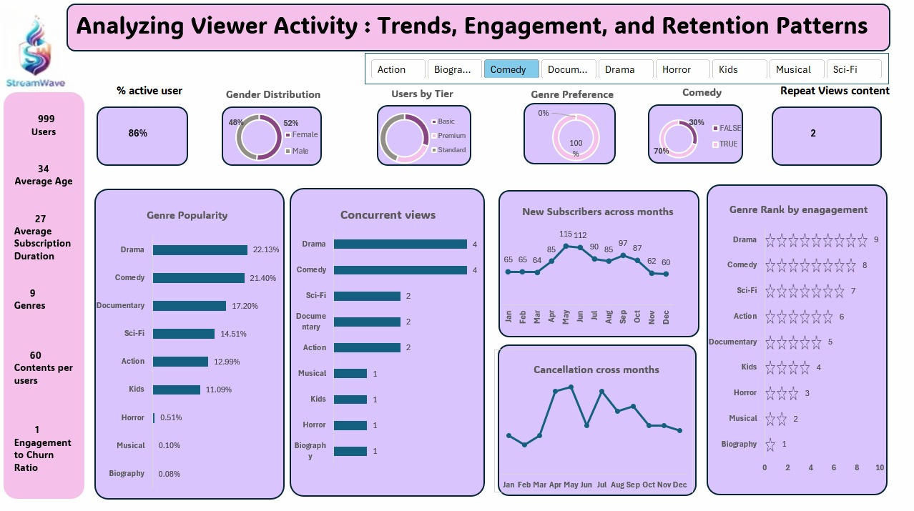

# 📺 StreamWave Analytics (Excel Project)

## About the Project

This project analyses streaming platform subscriber and content data using Excel to uncover trends in revenue, viewer engagement, and churn behaviour. I transformed raw subscription and viewing activity data into structured KPI analysis using pivot tables, calculated metrics, and data modelling.

## Key Metrics

- **Total Subscribers:** 1,000
- **Total Watch Events:** 60,000
- **Monthly Revenue:** $12,750
- **Churn Rate:** 12.9%
- **Average Subscription Duration:** 27 months

## What I Did

- Cleaned and structured two datasets (users and viewing activity) for accurate reporting
- Built pivot tables to summarise revenue, engagement, and subscriber behaviour by tier
- Analysed churn vs. renewal patterns across Basic, Standard, and Premium subscribers
- Measured content performance by genre across 60,000 watch events
- Calculated KPIs including completion rate, repeat views, and average watch duration
- Identified top-performing genres and underperforming content segments

## Dashboard Preview

## Key Insights

- **Drama and Comedy drove the most views** — together accounting for over 43% of all watch events
- **Churn was concentrated in shorter-tenure subscribers** — most cancellations occurred within the first 20 months
- **Standard tier generated the highest revenue** at $5,768/month, outpacing both Basic and Premium
- **Completion rates were highest for Biography content** — averaging 133 minutes watched per session
- **Musical and Horror genres were significantly underutilised** — combined share under 1% of total views

## Tools & Techniques

- Pivot Tables & Pivot Charts
- Calculated KPIs (churn rate, completion rate, repeat view ratio)
- Date decomposition (Year, Quarter, Month)
- Data modelling across relational tables
- Subscription duration analysis
- Revenue breakdown by subscription tier

## Deliverables

- Cleaned Excel dataset (users + viewing activity)
- Pivot-based KPI analysis
- Genre and engagement breakdown
- Churn and retention insight summary
